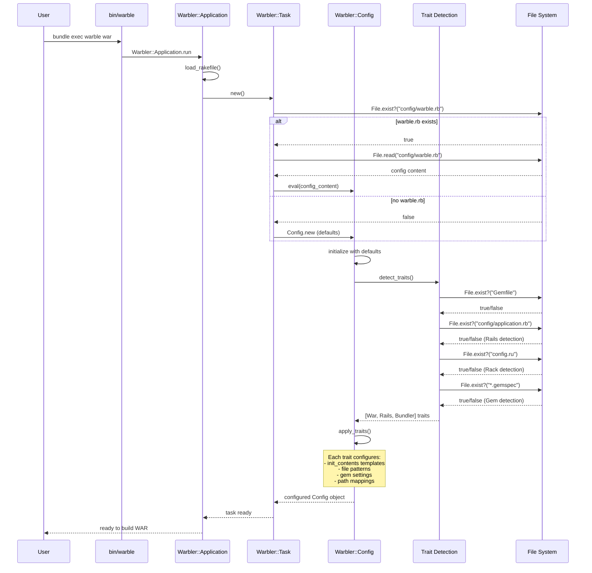

### Diagram

```mermaid
sequenceDiagram
    participant User
    participant warble_bin as bin/warble
    participant WarblerApp as Warbler::Application
    participant WarblerTask as Warbler::Task
    participant Config as Warbler::Config
    participant Traits as Trait Detection
    participant FS as File System

    User->>warble_bin: bundle exec warble war
    warble_bin->>WarblerApp: Warbler::Application.run
    
    WarblerApp->>WarblerApp: load_rakefile()
    WarblerApp->>WarblerTask: new()
    
    WarblerTask->>FS: File.exist?("config/warble.rb")
    alt warble.rb exists
        FS-->>WarblerTask: true
        WarblerTask->>FS: File.read("config/warble.rb")
        FS-->>WarblerTask: config content
        WarblerTask->>Config: eval(config_content)
    else no warble.rb
        FS-->>WarblerTask: false
        WarblerTask->>Config: Config.new (defaults)
    end
    
    Config->>Config: initialize with defaults
    Config->>Traits: detect_traits()
    

    Traits->>FS: File.exist?("Gemfile")
    FS-->>Traits: true/false
    Traits->>FS: File.exist?("config/application.rb")
    FS-->>Traits: true/false (Rails detection)
    Traits->>FS: File.exist?("config.ru")
    FS-->>Traits: true/false (Rack detection)
    Traits->>FS: File.exist?("*.gemspec")
    FS-->>Traits: true/false (Gem detection)
    
    Traits-->>Config: [War, Rails, Bundler] traits
    Config->>Config: apply_traits()
    
    Note over Config: Each trait configures:<br/>- init_contents templates<br/>- file patterns<br/>- gem settings<br/>- path mappings
    
    Config-->>WarblerTask: configured Config object
    WarblerTask-->>WarblerApp: task ready
    WarblerApp-->>User: ready to build WAR

```