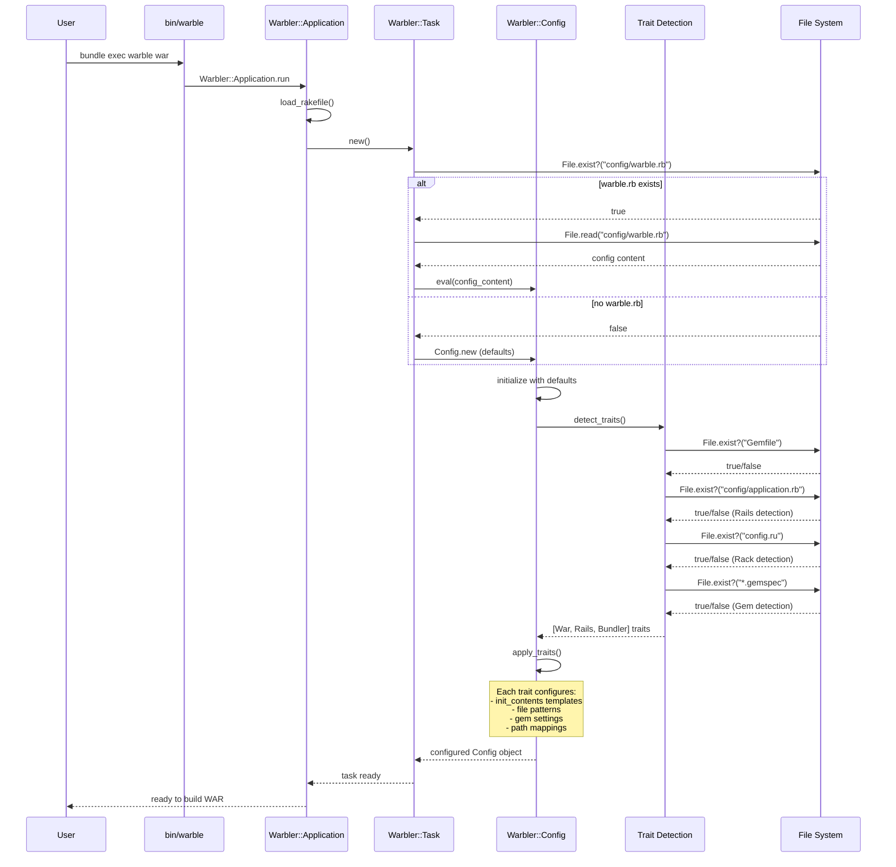
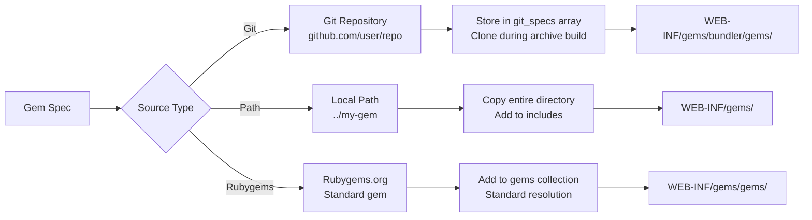
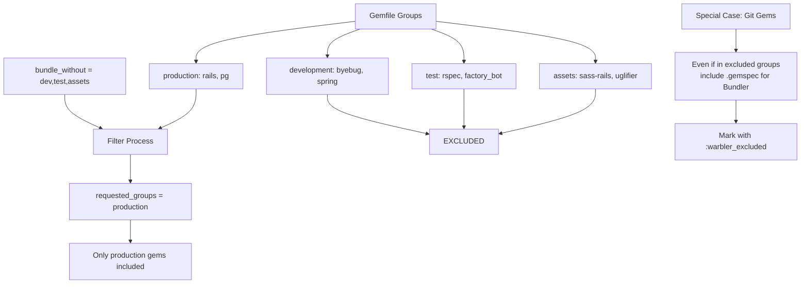

### Diagram

#### 2. Configuration Detection & Loading

Key Files Involved:

1. bin/warble - Entry point
2. config/warble.rb - User configuration (optional)
3. Gemfile - Bundler detection
4. config/application.rb - Rails detection  
5. config.ru - Rack detection
6. *.gemspec - Gem project detection
7. Rakefile - Project Rakefile loading
8. Trait templates - war.erb, bundler.erb, rails.erb, etc.

#### 4. Gem resolution and source type handling

#### Group Filtering Logic:

#### Archiving process

Add Bundler Gemfiles and git repositories to the archive.
  `def add_bundler_files(jar)`

## GEM_HOME vs GEM_PATH

GEM_HOME: Where gems are installed
• Single directory path
• Where gem install puts new gems
• Where RubyGems writes gem files

GEM_PATH: Where gems are searched
• Colon-separated list of directories
• Where RubyGems looks for gems to load
• Includes GEM_HOME + additional search paths

## Example:

bash
GEM_HOME=/usr/local/gems
GEM_PATH=/usr/local/gems:/system/gems:/home/user/.gems

When you require 'rails', RubyGems searches in this order:
1. /usr/local/gems/gems/rails-*
2. /system/gems/gems/rails-* 
3. /home/user/.gems/gems/rails-*

## In Warbler Context:

ruby
### war.erb template sets:
ENV['GEM_HOME'] = '/WEB-INF/gems'     # Install location inside WAR
ENV['GEM_PATH'] = nil                 # Only search GEM_HOME

### This means:

 - All gems are in /WEB-INF/gems inside the WAR file
 - Don't search system gems outside the WAR
 - Self-contained gem environment

Why GEM_PATH = nil?
• Prevents loading system gems that aren't bundled in WAR
• Ensures application only uses packaged gems
• Avoids version conflicts with host system

## rails.erb Template

ruby
ENV['RAILS_ENV'] ||= ENV_JAVA[ 'RAILS_ENV' ] || '<%= config.webxml.rails.env %>'

## What it does:

Sets Rails environment in priority order:

1. ENV['RAILS_ENV'] - Ruby environment variable (highest priority)
2. ENV_JAVA['RAILS_ENV'] - Java system property -DRAILS_ENV=production
3. config.webxml.rails.env - Warbler config default (usually 'production')

## Why this matters:

• **Java Integration**: Allows setting Rails env via Java system properties
• **Servlet Container**: Can configure environment through container settings
• **Default Fallback**: Ensures Rails env is always set (prevents development mode in production)

## Example Flow:

bash
# Java system property takes precedence
java -jar myapp.war -DRAILS_ENV=staging

# Becomes:
ENV['RAILS_ENV'] = 'staging'

## In web.xml context:

xml
<context-param>
  <param-name>rails.env</param-name>
  <param-value>production</param-value>
</context-param>

This simple template ensures Rails applications run in the correct environment when deployed as WAR files in Java servlet containers, with flexible configuration options for different deployment scenarios.

